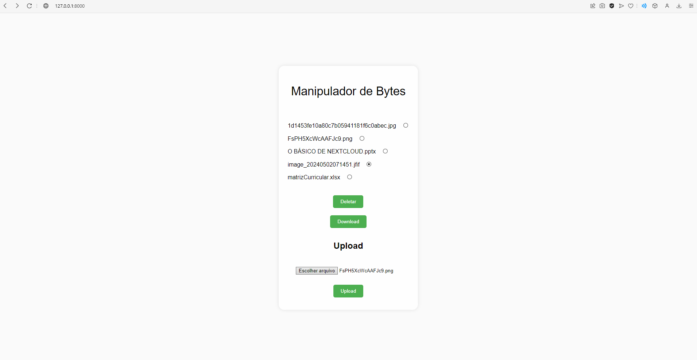

# Manipulador de Bytes

O **Manipulador de Bytes** é um projeto desenvolvido com o objetivo de aplicar e demonstrar conhecimentos práticos sobre o protocolo HTTP e o WebDAV, integrando esses conceitos à API do Nextcloud. Este projeto permite o upload, download, listagem e exclusão de arquivos em um servidor remoto utilizando a biblioteca `webdavclient3` e o framework Django.

## Tecnologias Utilizadas

- **Python**: Linguagem de programação principal.
- **Django**: Framework web utilizado para desenvolver a aplicação.
- **WebDAV**: Protocolo utilizado para manipulação de arquivos no servidor remoto.
- **Nextcloud**: Plataforma de nuvem privada que fornece a API WebDAV utilizada no projeto.
- **dotenv**: Biblioteca utilizada para gerenciar variáveis de ambiente.

## Funcionalidades

O projeto **Manipulador de Bytes** inclui as seguintes funcionalidades:

- **Upload de Arquivos**: Permite o envio de arquivos do usuário para o servidor remoto.
- **Download de Arquivos**: Permite que os usuários baixem arquivos do servidor remoto para o seu sistema local.
- **Listagem de Arquivos**: Exibe uma lista de todos os arquivos presentes em um diretório específico no servidor remoto.
- **Exclusão de Arquivos**: Permite a remoção de arquivos no servidor remoto.

## Configuração e Uso

### Pré-requisitos

- Python 3.x
- Virtualenv (opcional, mas recomendado)
- Django
- requests
- webdavclient3
- dotenv

### Configuração do Ambiente

1. Clone o repositório:
   ```bash
   git clone https://github.com/seu-usuario/manipulador-de-bytes.git
   cd manipulador-de-bytes
   ```

2. Crie um ambiente virtual e ative-o:
    ```bash
    python3 -m venv venv
    source venv/bin/activate  # Linux/MacOS
    venv\Scripts\activate     # Windows
    ```

3. Instale os pacotes:
    ```bash
    pip install -r requirements.txt
    ```

4. Configure as variáveis de ambiente no arquivo `.env` seguindo o exemplo:
    ```
    WEBDAV_USERNAME=seu_usuario
    WEBDAV_PASSWORD=sua_senha
    WEBDAV_DIR=seu_diretório 
    WEBDAV_URL=nextcloud_url
    ```

5. Execute o servidor Django:
    ```bash
    python manage.py runserver
    ```

### Usando a Aplicação

- Acesse `http://localhost:8000` em seu navegador para interagir com a aplicação.

- Você poderá enviar, listar, baixar e excluir arquivos através da interface fornecida.

## Visual


## Aprendizados e Aplicações

Durante o desenvolvimento deste projeto, foram aplicados conhecimentos importantes sobre:

- **Protocolo HTTP:** Manipulação de requisições e respostas HTTP, autenticação e tratamento de erros.

- **WebDAV**: Utilização do protocolo para gerenciar arquivos de forma remota através de uma interface simples.

- **Integração com APIs:** Comunicação eficaz com a API do Nextcloud utilizando requisições HTTP autenticadas.

## Referências:

 - [NextCloud: o que você precisa saber sobre hospedagem de arquivos em nuvem](https://serverdo.in/nextcloud-hospedagem-de-arquivos-em-nuvem/)

 - [What is WebDAV?](https://www.jscape.com/blog/what-is-webdav)

 - [Basic APIs](https://docs.nextcloud.com/server/latest/developer_manual/client_apis/WebDAV/basic.html)

 

    

